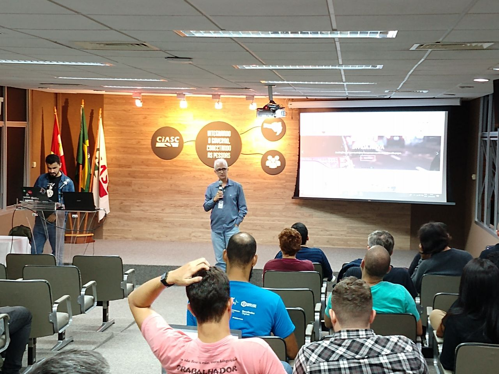
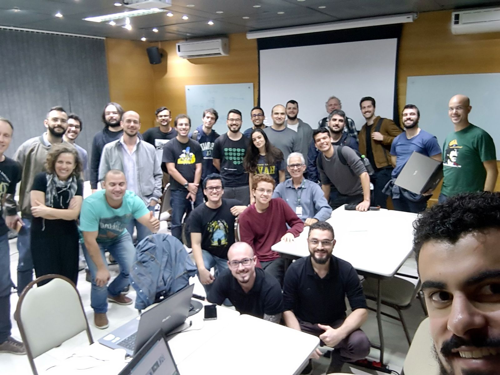

# Relatório Florianpopolis 24/05/2019

Nos dias 24 e 25 de maio, ocorreu o mais recente evento nos envolvendo. O terceiro Sprint da Operação Serenata de Amor , no Ciasc, em Florianópolis. Um espaço com estrutura de auditório, salas de reunião e laboratórios completamente preparados para o melhor curso das atividades.

O Ciasc, Centro de Informática e Automação do Estado de Santa Catarina, é uma empresa pública, que há mais de 40 anos desenvolve soluções tecnológicas para que o Governo do Estado e dos Municípios entreguem à população catarinense serviços mais modernos, ágeis e inovadores. A empresa é responsável por infraestrutura de redes e serviços de datacenter para o governo de Santa Catarina.

Dentre as 45 pessoas presentes havia representantes de diversas áreas, como cientistas de dados, programadores, jornalistas, físicos e jovens cientistas da computação. Foram dois dias de muita troca de informações e contribuição para o projeto open source mais popular no Brasil.

Com o lugar ideal e quase 50 participantes engajados em diversas atividades técnicas, como estudos para a otimização da Rosie, foram feitas várias análises, relativas aos dados públicos das cotas dos deputados federais. Ao total, foram abertos sete Pull Requests no repositório principal do projeto serenata de amor. (https://github.com/okfn-brasil/serenata-de-amor/pulls)

Destacam-se as seguintes contribuições:

* Várias atualizações na documentação do projeto, o que auxilia a preparação de ambiente para quem deseja reproduzir a execução da Rosie e Jarbas localmente.
* Iniciaram-se trabalhos para otimização de memória no tratamento de dados da Rosie.
* Inclusão de links para perfis de redes sociais nas notas da base de dados do Jarbas.

O grupo de Florianópolis, por exemplo, ainda continua com ideias e sugestões, mesmo após o término do sprint. O objetivo é que o projeto ainda ganhe mais melhorias e sugestões, vinda da comunidade que irá se formar em torno dos eventos. Como dizemos, o Serenata não é nosso. Nós precisamos e queremos ter a população colaborando de perto em todos os momentos do projeto.

Organizar Sprints distribuídos no território nacional ajudará na colaboração e distribuição da informação, além de adequar às realidades regionais do Brasil, como entender se os gastos de um determinado deputado estão de acordo com a realidade e a serviço de cidadãos de sua região.

Qualquer membro da sociedade civil pode participar deste evento, seja na análise de documentos evidenciados pela Operação, como notas fiscais, localização de estabelecimentos, quantidades. Para a coleta e processamento desta informação, desenvolvedores e especialistas em dados podem conectar-se através de diversas mídias sociais, repositórios de códigos-fonte e dados.
